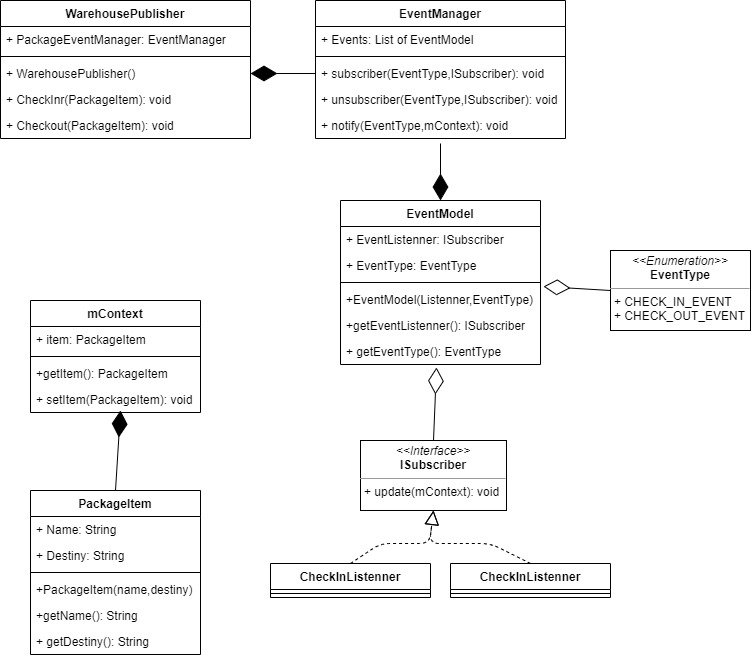
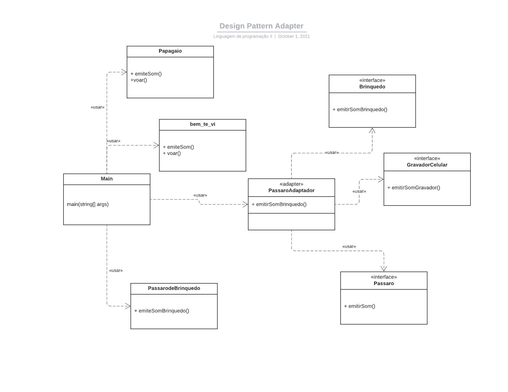

# Entrega-N1-2BIM-LP2

Entrega de projeto da disciplina de Linguagem de Programação 2

## Projeto 1: [Desing Pattern Observer] Gestão de Entrada de itens em um depósito logistico

#### Sobre o design Pattern utilizado

Nome:
```
    Observer
```


Tipo:

``` 
    Comportamental
```

Objetivo:

```
Através de um mecanismo de assinatura permite notificar múltiplos objetos que tenham 
necessidade ou interesse de ser informado mediante algum acontecimento (evento)
```

Diagrama UML


Código:
[Veja aqui o repositório](https://github.com/Yago-Caetano/Pattern_Observer_Warehouse)
 
## Projeto 2: [Design Pattern Structural] - Simulador de Som de Passaros

#### Sobre o design Pattern utilizado

Nome: 
```
    Adapter
```


Tipo:

``` 
    Estrutural
```

Objetivo:

```
O Adapter é um padrão de projeto estrutural que permite objetos com interfaces 
incompatíveis colaborarem entre si.
```

Diagrama UML
![Diagrama UML]




Código:
[Veja aqui o repositório](https://github.com/RogerKenichi/AtividadePadraoAdapter)

 ## 💻 Desenvolvedores

<table>
    <tr>
        <td>Yago Caetano</td>
        <td>RA: 081190027</td>
				<td>https://github.com/Yago-Caetano</td>
    </tr>
    <tr>
        <td>Rodrigo Emiliano</td>
        <td>RA: 081190004</td>
				<td>https://github.com/RodrigoEmiliano27</td>
    </tr>
    <tr>
        <td>Guilherme Tavares</td>
        <td>RA: 081190035</td>
				<td>https://github.com/guiTavares13</td>
    </tr>
    <tr>
        <td>Roger kenich</td>
        <td>RA: 081190026</td>
				<td>https://github.com/RogerKenichi</td>
    </tr>
    <tr>
        <td>Lucas Santos</td>
        <td>RA: 081190015</td>
				<td>https://github.com/lucasscbr</td>
    </tr>
</table>
